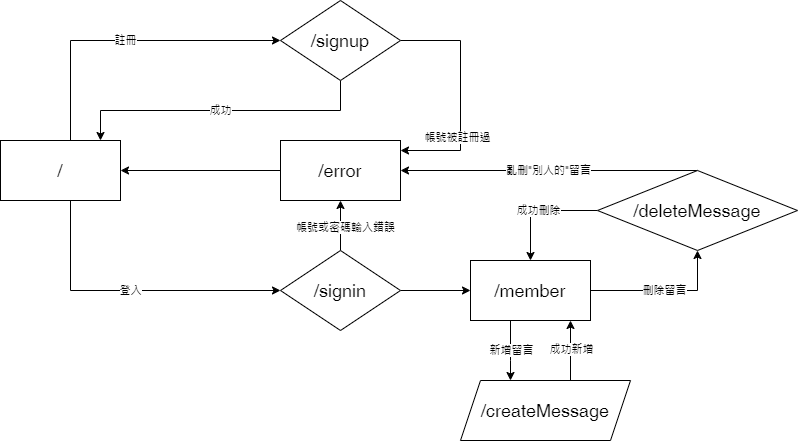
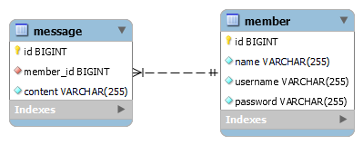

# Week6 assignment

## Core-concept and Solution

### user status part

1. user status(user id) are recorded by signed cookie-base session (all of information are set at signed cookie), name is cookie-token
2. signer: python package "itsdangerous"
3. if cookie was modified, return error message

### submit message part

4. when render all message in member page, "message id" were recorded in id attributes in a specific html element by html template input value
5. trash button were be replace to another html element when render.
6. back-end also checked whether message want to be delete is belong to himself/herself

## User flow

## ERD

